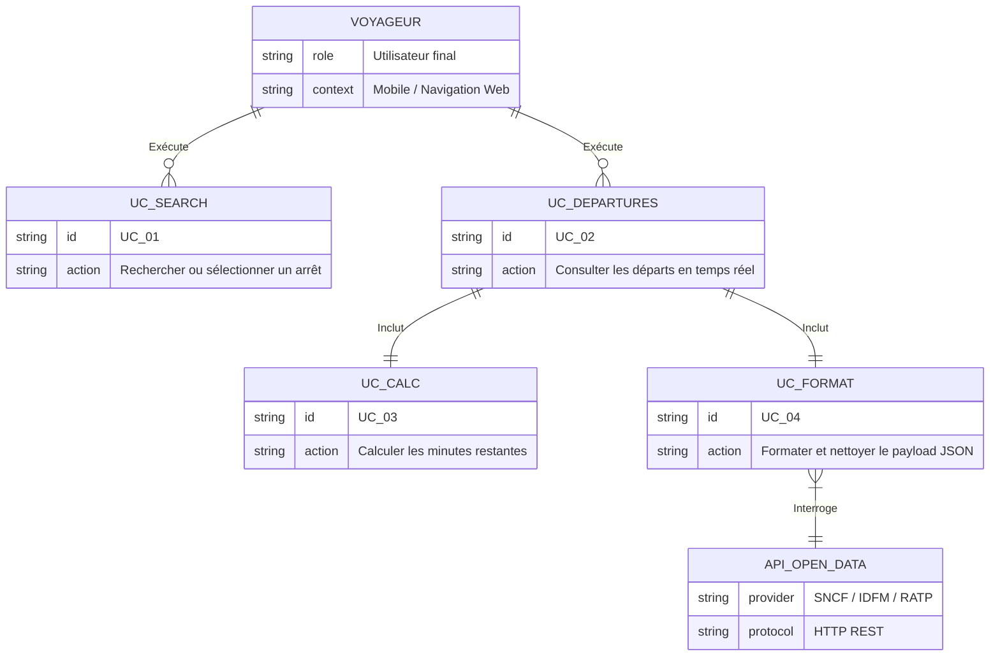
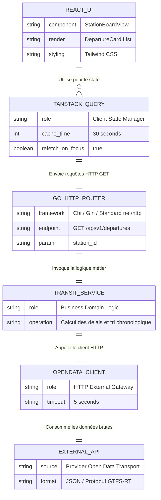

## 📐 Conception & Spécifications

### 1. Diagramme des Cas d'Utilisation (Use Cases)

```mermaid
erDiagram
    VOYAGEUR ||--o{ UC_SEARCH : "Exécute"
    VOYAGEUR ||--o{ UC_DEPARTURES : "Exécute"
    
    UC_DEPARTURES ||--|| UC_CALC : "Inclut"
    UC_DEPARTURES ||--|| UC_FORMAT : "Inclut"
    
    UC_FORMAT }|--|| API_OPEN_DATA : "Interroge"

    VOYAGEUR {
        string role "Utilisateur final"
        string context "Mobile / Navigation Web"
    }

    UC_SEARCH {
        string id "UC_01"
        string action "Rechercher ou sélectionner un arrêt"
    }

    UC_DEPARTURES {
        string id "UC_02"
        string action "Consulter les départs en temps réel"
    }

    UC_CALC {
        string id "UC_03"
        string action "Calculer les minutes restantes"
    }

    UC_FORMAT {
        string id "UC_04"
        string action "Formater et nettoyer le payload JSON"
    }

    API_OPEN_DATA {
        string provider "SNCF / IDFM / RATP"
        string protocol "HTTP REST"
    }
```

---

### 2. Diagramme d'Architecture de Composants

```mermaid
erDiagram
    REACT_UI ||--o{ TANSTACK_QUERY : "Utilise pour le state"
    TANSTACK_QUERY ||--|| GO_HTTP_ROUTER : "Envoie requêtes HTTP GET"
    GO_HTTP_ROUTER ||--|| TRANSIT_SERVICE : "Invoque la logique métier"
    TRANSIT_SERVICE ||--|| OPENDATA_CLIENT : "Appelle le client HTTP"
    OPENDATA_CLIENT ||--|| EXTERNAL_API : "Consomme les données brutes"

    REACT_UI {
        string component "StationBoardView"
        string render "DepartureCard List"
        string styling "Tailwind CSS"
    }

    TANSTACK_QUERY {
        string role "Client State Manager"
        int cache_time "30 seconds"
        boolean refetch_on_focus "true"
    }

    GO_HTTP_ROUTER {
        string framework "Chi / Gin / Standard net/http"
        string endpoint "GET /api/v1/departures"
        string param "station_id"
    }

    TRANSIT_SERVICE {
        string role "Business Domain Logic"
        string operation "Calcul des délais et tri chronologique"
    }

    OPENDATA_CLIENT {
        string role "HTTP External Gateway"
        string timeout "5 seconds"
    }

    EXTERNAL_API {
        string source "Provider Open Data Transport"
        string format "JSON / Protobuf GTFS-RT"
    }
```
