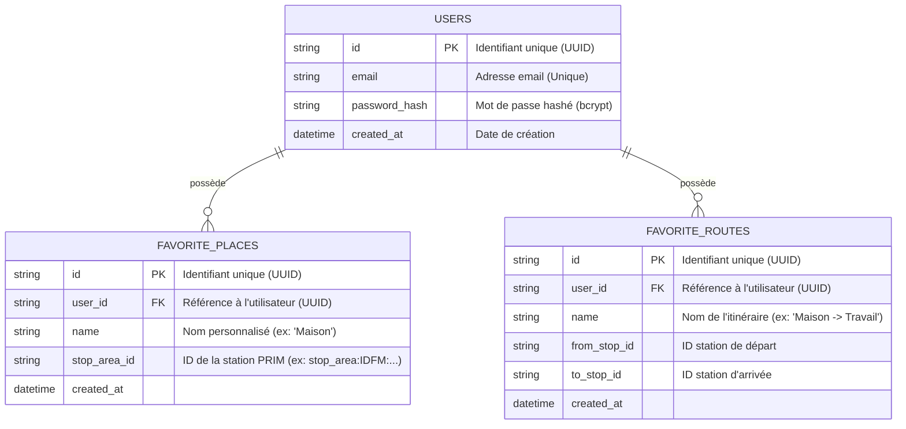

# Schéma de Base de Données (SQLite)

Pour gérer les comptes utilisateurs et leurs favoris (lieux et itinéraires), nous utilisons une base de données relationnelle **SQLite**.

Voici la structure des tables (MCD - Modèle Conceptuel de Données).

## Détails de l'implémentation
*   **Technologie :** `SQLite3` (Fichier local `.db` dans le backend Go).
*   **Sécurité :** Les mots de passe seront obligatoirement hashés (avec `bcrypt`) avant insertion dans la table `users`.
*   **ORM :** L'interaction avec la base se fera via GORM (l'ORM le plus populaire en Go) ou directement en SQL via `database/sql`.
